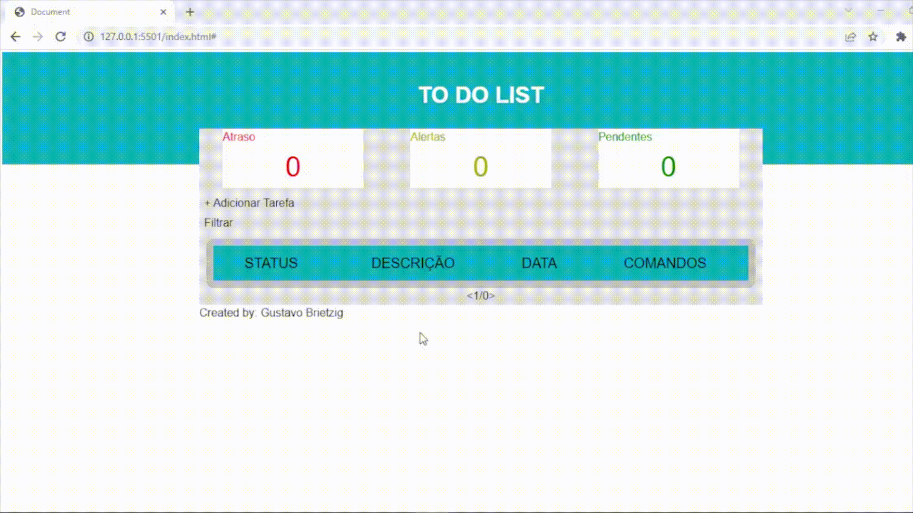
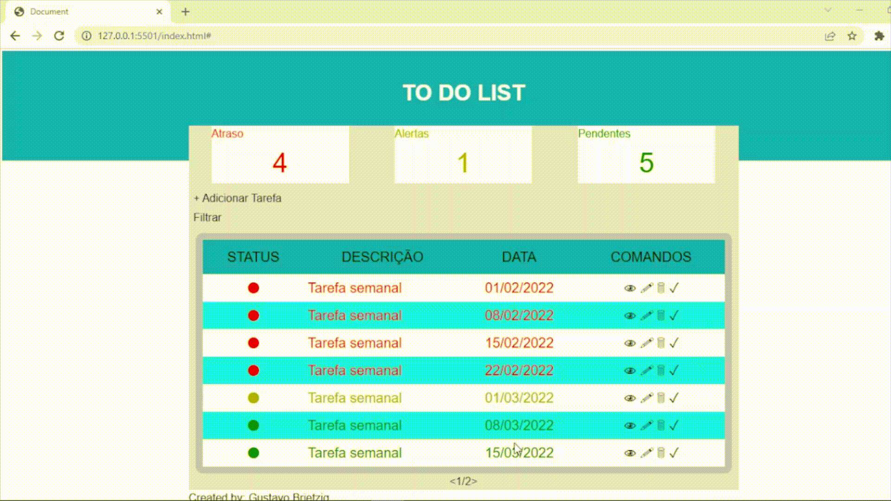
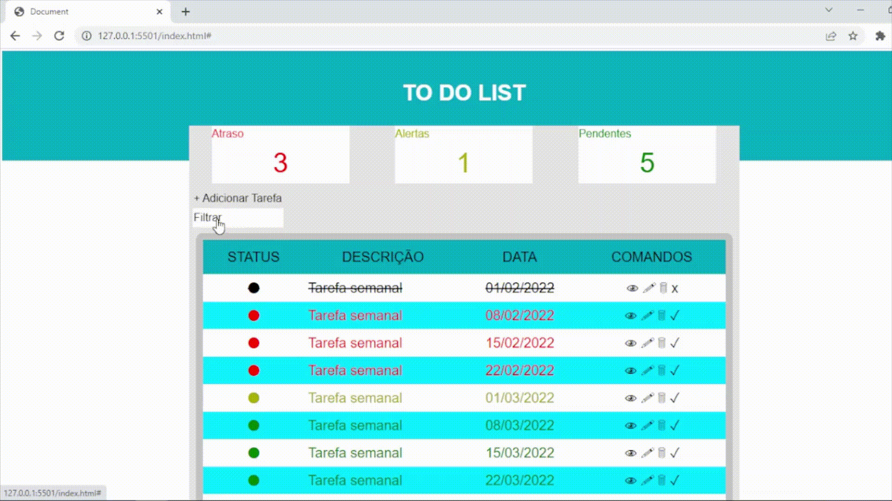

# to-do-list-challenge

  <a href="#-projeto">Projeto</a>&nbsp;&nbsp;&nbsp;|&nbsp;&nbsp;&nbsp;
  <a href="#-alertas-e-observações">Alertas e observações</a>&nbsp;&nbsp;&nbsp;|&nbsp;&nbsp;&nbsp;
  <a href="#-tecnologias">Tecnologias</a>&nbsp;&nbsp;&nbsp;|&nbsp;&nbsp;&nbsp;
  <a href="#eyes-demonstrações">Demonstrações</a>

  
  

 

## 💻 Projeto

Um projeto desenvolvido pelo aluno <b>Gustavo Brietzig</b>

O projeto foi proposto como uma avaliação de conclusão do módulo 05 do curso Degree - WEB da Let's Code.

O Desafio consiste em desenvolver um "to do list" utilizando apenas HTML, CSS e JAVASCRIPT. O projeto possui os seguintes requisitos obrigatórios e complementares sendo eles:

Obrigatórios:

- [X] Utilizar JS, HTML e CSS puro, ou seja sem qualquer tipo de biblioteca ou framework
- [X] A solução deve apresentar um campo para inserir o nome da tarefa a ser feita e um botao para adicionar a tarefa a lista
- [X] Ao adicionar uma nova tarefa esperar 2 segundos para que seja exibido na lista de tarefas.
- [X] Ao adicionar uma nova tarefa ela deverá vir por padrão no estado de a fazer
- [X] A solução deve apresentar uma lista para listar as tarefas
- [X] Cada elemento da lista deverá apresentar 2 estados diferentes, um pra item a se fazer e um para item feito e tem que ter uma diferença visual entre eles
- [X] Ao clicar no item da lista o mesmo deve mudar se estado, feito -> a fazer ou a fazer -> feito
- [X] Deve ser possível armazenar quantos items o usuario quiser a lista
- [X] A lista deve ser armazenada de uma forma que se o usuario entrar novamente na pagina ele poderá ver todos os itens ja cadastrados e seus respectivos estados
- [X] Criar uma boa documentação para a solução (README).

Complmentares:

- [X] Implementar uma solução otimizada
- [X] Em cada elemento da lista apresentar um botao de deletar e caso o usuario aperte esse botao o item some da lista
- [X] Implementar uma boa interface gráfica para a solução
- [ ] Publicar a aplicação em algum ambiente (GitHub Pages,...)
- [ ] caso o aluno queira implementar mais alguma funcionalidade fique a vontade, mas deixe explicado no README

Por conta do último requisito complementar, foram elencados algumas possíveis melhorias, mas nem todas foram implementadas, deixando uma lacuna para evolução do código:

- [X] Tarefas semanais
- [X] Tarefas mensais
- [X] Visualização e edição de tarefas
- [X] Comentário secundário
- [X] Paginação
- [X] Inserção de novas categorias (em atraso, em alerta - tarefas com prazo para o mesmo dia ou para o dia seguinte)
- [X] Filtro por categoria
- [X] Filtro por prazo
- [ ] Login
- [ ] Página de boas vindas para o primeiro login do dia trazendo tarefas atrasadas e em alerta, com botão MOSTRE-ME para filtrar essas tarefas automaticamente
- [ ] Ordenar as tafefas pela categoria, descrição ou prazo
- [ ] Validação de manipulação manual do STORAGE
- [ ] Sistema de identificação de tarefas mensais nos últimos dias do mês
- [ ] Impressão da lista de tarefas adicionando um comando PRINT() no JS e um botão no HTML para executar a tarefa
- [ ] Layout responsivo

## 🚨 Alertas e observações

- Todos os dados utilizados pela aplicação são salvos dentro do navegador do usuário, logo esse pode manipulá-los facilmente. Essa manipulação pode facilmente corromper o fluxo da aplicação e/ou expor dados sensíveis como por exemplo em caso de implementação de logins e senhas. Por esse motivo esse alerta deve sempre ser reforçado ao replicar esse código.
- O desenvolvimento desse código não implementou apenas uma metodologia, podendo servir inclusive como material de estudo, um exemplo a implementação do evento onClick, que foi implmentando diretamente no código HTML, pelo código JS diretamente no elemento HTML e também no pai do elemento HTML para atribuir o evento a todos os filhos.
- Todos os formulários (cadastro de tarefas e filtro) se comunicam com a aplicação pelo mesmo fluxo, mas sendo tratados de maneira indepedentes. O que permite a criação de novos formulários, inclusive é possível, ao criar um novo formulário definir se esse irá fechar o MODAL ou não ao clicar clicar fora do formulário (podendo criar um formulário de login e não permitindo a liberação da aplicação sem a autenticação).

## 🚀 Tecnologias

Esse projeto foi desenvolvido com as seguintes tecnologias:

- HTML
- CSS
- JavaScript

## :eyes: Demonstrações

Criar uma tarefa simples</a>

Com esse recurso o usuário adiciona uma tarefa à sua lista

Criar uma tarefa com repetição semanal</a>

Com esse recurso o usuário adiciona multiplas tarefas com um intervalo de 7 dias à sua lista

Criar uma tarefa com repetição mensal</a>

Com esse recurso o usuário adiciona multiplas tarefas com um intervalo de 1 mês à sua lista. Uma observação, caso o dia exceda o mês posterior, o mesmo avançará para os primeiros dias do mês subsequente e por ser base para os demais, alterará a data do prazo das demais tarefas.

Utilização dos comandos da tarefa</a>

Alguns comandos podem ser dados diretamente à tarefa através dos botões atrelados a cada tarefa:
  
- 👁: visualizar - expande a tarefa na tela
  
- 🖉: edição - permite editar as informações da tarefa
  
- 🗑: deletar - permite retirar a tarefa da lista de tarefas
  
- ✓: concluir - permite marcar a tarefa pendente como concluída
  
- X: pendente - permite marcar a tarefa concluída como pendente novamente
 

Paginação</a>

Com esse recurso o usuário adiciona pode navegar por páginas que dividem a exibição das tarefas do usuário. O limite de tarefas por página é definido como 7 por padrão, mas pode ser alterado no filtro.

Filtro</a>

Com esse recurso o usuário pode selecionar quantas tarefas ele deseja exibir na tela, quais categorias e qual o período desejado. As categorias também podem ser selecionadas clicando nos contadores na página principal.

