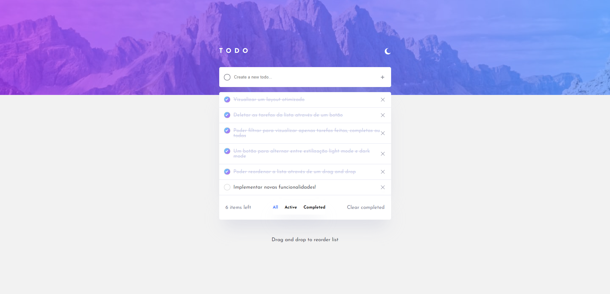
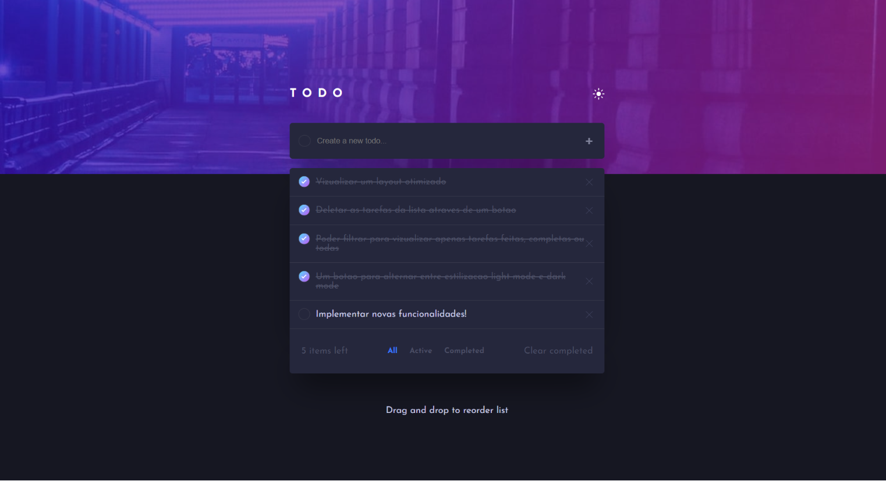
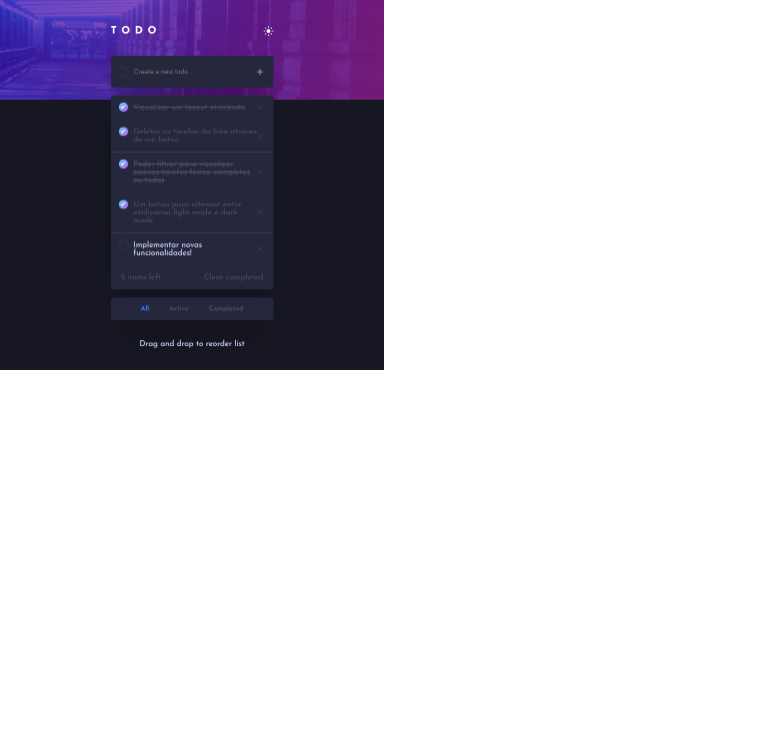

# Lets Code - Todo app

Esta é uma solução desenvolvida para um challenge da [Lets Code](https://www.letscode.com.br/). Este projeto utilizou como base para o layout os designs fornecidos pelo [Frontend Mentor](https://www.frontendmentor.io/challenges/todo-app-Su1_KokOW)

## Indice

- [Visão Geral](#Visão-Geral)
  - [O Desafio](#O-Desafio)
  - [Screenshot](#screenshot)
  - [Manual do Usuario](#Manual-do-usuario)
  - [Links](#links)
- [Processo de desenvolvimento](#Processo-de-desenvolvimento)
  - [Tecnologias](#Tecnologias)
  - [Metodologias](#Metodologias)
  - [O que eu aprendi](#O-que-eu-aprendi)
  - [Implementacoes futuras](#Implementacoes-futuras)
  - [Recursos uteis](#Recursos-uteis)
- [Autor](#Autor)
- [Agradecimentos](#Agradecimentos)

## Visão Geral

Este APP consiste em uma lista de tarefas responsiva para os dispositivos mobile, tablet e desktop. O app conta com as funcionalidades de criar e deletar tarefas, marca-las como feitas ou desmarca-las, filtrar a lista para visualizar apenas tarefas feitas, não feitas ou todas, reorganizar as tarefas arrastando as até a posicao desejada, um contador de tarefas e também conta com um botao para alterar o tema do layout de light-mode para dark-mode.

### O Desafio

Os usuarios devem poder:

Requisitos Obrigatorios:

- Utilizar JS, HTML e CSS puro, ou seja sem qualquer tipo de biblioteca ou framework
- A solução deve apresentar um campo para inserir o nome da tarefa a ser feita e um botao para adicionar a tarefa a lista
- Ao adicionar uma nova tarefa segundo para que seja exibido na lista de tarefas.
- Ao adicionar uma nova tarefa ela deverá vir por padrão no estado de a fazer
- A solução deve apresentar uma lista para listar as tarefas
- Cada elemento da lista deverá apresentar 2 estados diferentes, um pra item a se fazer e um para item feito
- Ao clicar no item da lista o mesmo deve mudar se estado, feito -> a fazer ou a fazer -> feito
- Deve ser possível armazenar quantos items o usuario quiser a lista
- A lista deve ser armazenada de uma forma que se o usuario entrar novamente na pagina ele poderá ver todos os itens ja cadastrados e seus respectivos estados
- Criar uma boa documentação para a solução (README).

Requisitos Bonus:

- Adicionar um contador de tarefas.
- Vizualiar um layout otimizado dependendo do dispositivo.
- Deletar as tarefas da lista completa através de um botão.
- Poder filtrar para vizualizar apenas tarefas feitas, completas ou todas.
- Deletar todas as tarefas completadas.
- Um botão para alternar entre estilização light mode e dark mode.
- Poder reordenar a lista através de um drag and drop.

### Screenshot

Light Version:

Dark Version:

### Manual do usuario

1. Para adicionar uma nova tarefa, o usuario deve clicar sobre o create a new todo, escrever a descricao e apertar no botao de adicao representado pelo simbolo +. Tambem eh possivel adicionar uma nova tarefa escrevendo o nome dela e pressionando a tecla enter.
2. Para deletar UMA tarefa o usuario deve posicionar o mouse em cima da tarefa desejada. Com o mouse ja posicionado um icone representando um X sera exibido no canto direito da tarefa em que o cursor esta em cima, basta clicar no X para deletar a tarefa.
3. Para marcar a tarefa como FEITA basta clicar no checkbox em formato de circulo, localizado no canto esquerdo da tarefa.
4. Para deletar TODAS as tarefas FEITAS, basta clicar no botao clear completed.
5. Esta aplicacao conta com um contador que indica quantas tarefas existem na lista do usuario. Este contador fica no canto esquerdo que inicia-se com o valor de No Records caso nao haja nenhuma tarefa salva em local storage
6. Caso o usuario queira filtrar as tarefas ATIVAS ou seja, que nao foram feitas ainda, basta clicar no botao Active. Caso o usuario queira filtrar as tarefas ja feitas, basta clica no botao Completed. Por fim, caso o usuario queira ver todas as tarefas, basta clicar no botao All.
7. Esta aplicacao permite reordenar as tarefas da lista. Para realizar esta operacao, basta clicar na tarefa, segurar e arrastar a tarefa ate a posicao desejada.

8. Para alterar o tema da aplicacao de light mode para dark mode, basta clicar no icone de LUA/SOL no canto direito superior da lista.

OBS: Esta aplicacao salva apenas as tarefas e estados das tarefas. Portanto toda vez que o usuario reiniciar a pagina, o tema de preferencia devera ser escolhido novamente.

### Links

- Github Page: (https://alexandre-akira.github.io/to-do-list-challenge/)

## Processo de desenvolvimento

Para esta solução optei por estruturar o codigo em modulos, afim de separar adequadamente cada componente com foco em manutenabilidade e escalabilidade. Abaixo detalharei a estrutura:

- Pastas

1. Images: Essa pasta contem todas as imagens e icones utilizados no projeto e 6 imagens referente ao termino do projeto, que sera possivel ve-las na sessão de screenshot desse readme.
2. Scripts: Contem todos os modulos descritos no proximo topico.
3. Styles: Contem dois arquivos de estilo, app.css que estiliza a estrutura base da aplicação e contem o css de configuração global e reset e o todo.css que contempla todo o css utilizado para estilizar a lista de tarefas.

- Modulos:

1. app.js: Este modulo é responsavel pela aplicação inteira, portanto é nele que eu determino qual o nodulo que a aplicação ira ser renderizada e chamo o metodo init para inicializar a aplicação.
2. enum.js: Este modulo é como se fosse um enum. Aqui eu crio classes que contem variaveis estaticas para armazenar strings. Pensei dessa forma, porque caso eu tenha que fazer alguma manutenção que venha a mudar as strings, eu precisaria mudar apenas em um lugar ao inves de mudar no codigo inteiro.
3. todo.js: Este modulo é responsavel por armazenar todas as funções que pertencem a lista. Funções de criar, deletar, renderizar a lista, drag and drop entre outras. Pensei dessa forma com o intuito ganhar escalabilidade no projeto. Afinal dessa forma facilita a implementação de novas features ou adicionar essa feature a outro projeto..
4. task.js: Este modulo é responsavel pela estrutura da tarefa. Entao aqui encontra-se a classe que constroi a tarefa, o template html para criação das tarefas e por fim os metodos de get e set da tarefa. Pensei dessa forma para dar mais legibilidade ao codigo, uma vez que a classe todo estava ficando muito grande.

Seguindo esta estrutura pontuarei como a solucao foi pensada:

1. Idealizei um sistema que o javascript deveria criar o HTML da TODO list, pois assim eu poderia incorpora-lo em outro site com facilidade.
   Para que isso fosse possivel, implementei modulos que contem classes, cujas classes contem suas proprias funcoes e variaveis.
   Sendo assim, a classe contida no Todo ficou responsavel por criar o HTML da estrutura base da lista, que eh armazenada na variavel template da classe. Todas as funcionalidades da lista tambem sao armazenadas aqui, entao as funcoes de excluir, criar, reorganizar, mudar de darkmode para light mode estao todas armazenadas nessa classe.
   Ja o task, eh responsavel por criar a tarefa. Separei a tarefa da lista, pois eu percebi que eu precisava de uma estrutura padronizada para todas as tasks, sendo assim, criar uma classe task foi uma otima opcao. Portanto essa classe contem as seguintes propriedades, um ID do tipo privado para sanar questoes de seguranca, um status que armazena se a tarefa foi concluida ou nao e uma descricao que contem o texto que define a task. Alem disso ela possui os metodos get e set para atribuicoes a suas propriedades, afim de reduzir a quantidade de possiveis erros.
   Para nao me extender muito as funcoes que tornaram a solucao possivel estao documentadas no codigo.

### Tecnologias

- HTML 5
- CSS
- Flexbox
- Javascript

### Metodologias

- Mobile-first workflow
- Block Element Modifier (BEM)

### O que eu aprendi

- Desenvolver o drag and drop.
- Implementar um light e dark mode. Gostaria de pontuar que nas minhas proximas aplicacoes irei buscar definir primeiro quais elementos iram receber os temas e ja separa-los de forma que possa melhorar a legibilidade do codigo.
- Melhorei a estruturacao do meu codigo, mas devo admitir que eu nao consegui separar completamente o todo list do app. Pois o background que compoe o App eh atualizado pelo todo-list. Fazendo dessa forma meu codigo perde um pouco em reusabilidade e escalabilidade. Para sanar isso meus proximos codigos que envolverem features, seram completamente independentes. Sendo o app apenas uma estrutura inicial para renderizar os componentes.
- Aprendi que armazenar grandes informacoes no local storage reflete em grande perda de performance na pagina, portanto eu optei por armazenar apenas o essencial e utilizando variaveis para armazenar estruturas maiores.

### Implementacoes futuras

- A reorganizacao da lista através do drag and drop deve ser mantida mesmo depois da pagina ser recarregada.
- Desenvolver um alert para notificar as ações de sucesso ou erros na aplicação.
- Desenvolver animações para adicionar fluides nas interações entre usuario e aplicativo.
- O usuario deve poder planejar todos os dias da semana atraves de um dropdown para selecionar o dia da semana a ser planejado
- Desenvolver um alarme de lembrete contendo hora e data
- O tema escolhido pelo usuario deve ser mantido mesmo depois que a pagina for recarregada.
- O HTML que estrutura os filtros deve ser reestruturado, porque eu tive que criar duas estruturas quase identicas, dado que no desktop ele e exibido de uma forma diferente da exibicao no mobile
- Desenvolver um modal para confirmar as acoes de exclusao do usuario.

### Recursos uteis

- (http://getbem.com/naming/) - Me ajudou a estruturar meu css, tentei aplicar da melhor forma possivel o Block Element Modifier
- (https://developer.mozilla.org/pt-BR/docs/Web/API/HTML_Drag_and_Drop_API) - Esta documentacao me ajudou a entender o drag and drop do javascript
- (https://developer.mozilla.org/pt-BR/docs/Web/API/Element/getBoundingClientRect) - Esta documentacao me forneceu ferramentas para pegar as coordenadas necessarias da funcao drag and drop
- (https://angel-rs.github.io/css-color-filter-generator/) - Esse site me proporcionou o codigo para aplicar o filtro sobre a svg e alcancar a cor desejada.

## Autor

- Github - [Alexandre-Akira](https://github.com/Alexandre-Akira)
- Frontend Mentor - [@Alexandre-Akira](https://www.frontendmentor.io/profile/Alexandre-Akira)
- Linkedin - [AlexandreAkira](https://www.linkedin.com/in/alexandreakira/)

## Agradecimentos

Gostaria de agradecer o professor da Lets Code [Pedro Leão](https://github.com/pleaobraga) que me ajudou a esclarecer alguns pontos do projeto, principalmente na implementação do light e dark mode.
