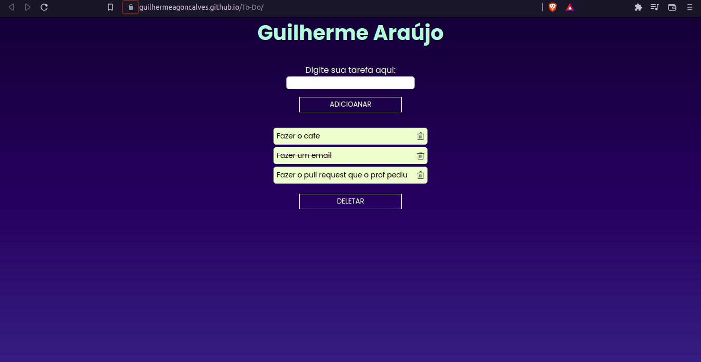
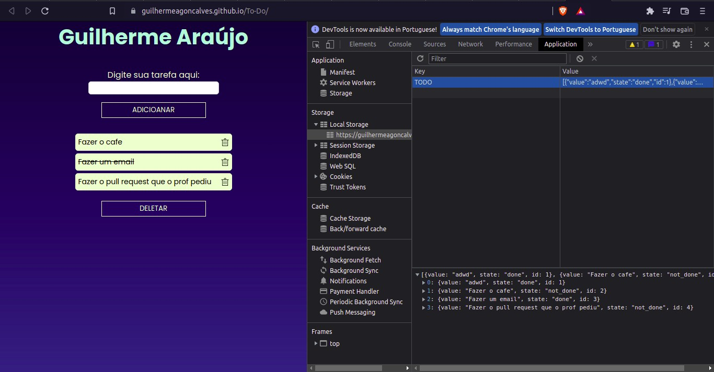

# To-Do

Este projeto foi desenvolvido por Guilherme De Araújo Gonçalves para o teste final do módulo de Front-End Dinâmico | JS Vanilla do Degree de Web Full Stack turma 816 da Let´s Code.

O projeto está hospedado no GitHub pages pelo link [To-Do](https://guilhermeagoncalves.github.io/To-Do/)

## Tecnologias usadas

- HTML
- CSS
- Java Script Puro

## Tarefa

Criar um projeto de uma aplicação web responsiva com funcionalidades como incerção/exclusão e mudança de estados(concluido e não concluido).

# Manual 

## Adicionar

1. Para adicionar basta escrever a tarefa que deseja no campo "Digite sua tarefa aqui:"

2. Clique no botão de "Adicionar" e após 2 segundos a tarefa será adicionada

## Marcar como concluida

1. Para marcar como concluida clique no item que deseja e então o item vai ficar com uma linha sobre ele.

## Deletar

Para deletar há duas formas:

1. Para deletar apenas o item que você deseja clique na imagem de lixeira que está no elemento.

2. Para deletar tudo clique no botão "Deletar" e ele vai deletar toda a lista de tarefas.

# Resolução do Problema

1. Primeiro pego todos os elementos do `HTML` que serão usados.

2. Crio as variaveis "myStorage" que vai ser o array de objetos para armazenar as tarefas no `local storage` e o "state" que vai iniciar o estado das tarefas como `not_done`(não feita).

## Criar `<li>`

Para criar o elemento `<li>` no `HTML` fiz uma função `createLi`, que recebe 3 argumentos (value, state, id), nessa função primeiro, ela vai criar a imagem, que depois vai ser usada para deletar o elemento `<li>`, em seguida ela cria o `<li>` em sim com o argumento id sendo o `id` do elemento no `HTML`, o state vai ser adicionado na `class` e o value vai ser o texto(tarefa a ser realizada) e depois a `<li>` é adicionada na `<ul>` com um `apendChild`.

## Adicionar

Para adicionar o elemento na tela fiz um `Event` no botão de "Adicionar" onde primeiro ele verifica se está vazio o campo de tarefa onde se estiver, emite um `alert` na página informando que o campo não pode ser vazio. Se não estiver vazio após 2000ms ele cria um "elementId" que vai criar um número baseado no tamanho do array "myStorage" depois ele vai adicionar em forma de objeto o que está escrito no campo tarefa, o estado que se encontra, que por padrão é `not_done`(a fazer) e o id criado por "elementId" no array "myStorage", em seguida ele vai adicionar no `local storage` esse array com a chave `TODO` depois de tudo ele vai atualizar a `<ul>` com esses mesmo valores em seguida ele vai limpar o campo "tarefa" para o usuario adicionar um novo valor.

## Ultilizando o local storage para reutilizar os dados

Para reutilizar os dados ja existentes no local storage salvo como array de objetos no "myStorage" fiz um forEach onde a ultilizo a função createLi para adicionar na `<ul>` os elementos do local storage toda vez que a pagina é carregada.

## Atualizar elementos

Criei um `event` de clique na `<ul>` onde primeiro vai ter uma função elementIndex para procurar o elemento pelo id no array "myStorage" e assim possibilitar a troca de estado no "myStorage" em seguida a cada clique acontece no elemento `<li>` ele muda de estado alterando a `class` dele no `HTML` entre `not_done e done`(não feito e feito) e alterando também o estado do objeto que se encontra no "myStorage".
## Deletando elemento

Para deletar apenas o elemento especifico eu fiz um `for` percorrendo todos os elementos da `<ul>` onde se o filho da `<ul>` for igual ao `<li>` que se quer deletar, deleto ele do "myStorage" usando splice e zero o `<li>`

## Salvando Alterações

Toda vez que um elemento é apagado ou é mudado de estado ele também é atualizado no `local storage`

## Deletando Tudo

Para deletar tudo criei um evento no botão deletar onde ele verifica se o usuario quer deletar toda a lista se sim ele limpa o `local storage` com um `clear()` e limpa o `<ul>` e emite um alert sinalizando que tudo foi deletado se não ele não altera nada e emite um alert dizendo que não foi apagado nada.

## Screenshot

