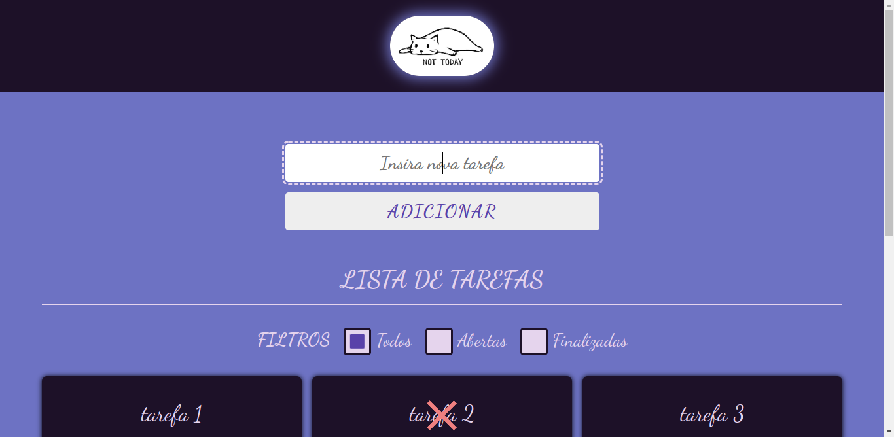
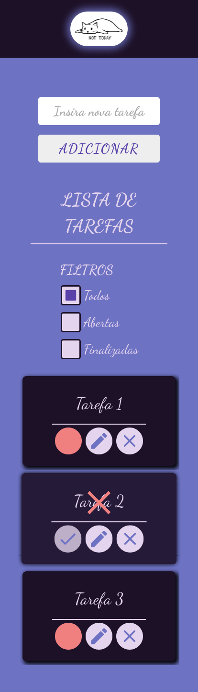

# to-do-list-challenge

## Autoria

Pedro Yure Nogueira da Silva.
Projeto feito como trabalho final do módulo 5 (Front End Dinâmico), do curso Web Full Stack da Let's Code.

## Lista de Tarefas

Este projeto consiste em um Web App responsivo que permite a criação de uma lista de tarefas com funcionalidades como inserção, edição, exclusão, filtro e marcação de status de tarefas.

A aplicação é baseada em HTML, CSS e Vanilla JavaScript.

### Links

- [URL da versão live](https://goofy-newton-da2432.netlify.app/)

### Screenshot

## Manual do Usuário

### Inserir tarefa

1. Insira o nome de uma tarefa no campo "Insira nova tarefa".
2. Clique no botão "adicionar" ou aperta a tecla enter. A tarefa será adicionada à lista após 2 segundos.

### Marcar tarefa como feita

1. Clique no checkbox (botão mais a esquerda que aparece no bloco da tarefa) para marcar a tarefa como feita. Quando marcada como feita, na parte interna do checkbox aparecerá um símbolo de "check" e sobre o nome da tarefa aparecerá um X sinalizando sua compleção.
2. A compleção da tarefa pode ser revertida clicando outra vez no checkbox.

### Filtrar tarefas

É possível selecionar quais tarefas estarão à mostra na tela. As opções são:

- Todas
- Abertas (não completas)
- Finalizadas

### Editar Tarefa

1. Clique no botão do meu para editar a tarefa desejada. A caixa de edição aparecerá no centro da tela.
2. Na caixa de edição, clique no espaço para editar o nome atual da tarefa.
3. Para completar a operação:

- Clique no botão de confirmar ou,
- Clique no botão de cancelar para cancelar a edição.

### Excluir tarefa

1. Clique no botão de excluir (botão a direita na tarefa que deseja excluir). Uma caixa de exclusão aparecerá no centro da tela.
2. Para completar a operação:

- Clique no botão de confirmar ou,
- Clique no botão de cancelar para cancelar a exclusão da tarefa.

### Excluir todas as tarefas completadas de uma vez

Para excluir todas as tarefas completadas com apenas um clique, selecione o filtro "finalizadas". O botão para excluir todas as tarefas de uma vez aparecerá no canto inferior esquerdo da tela. Para excluir todas as tarefas:

1. Clique no botão
2. Para completar a operação:

- Confirme a exclusão ou,
- Cancele a exclusão.

## Solução do Problema

A principal bloco da solução é a classe "tasksList" onde está definida toda a funcionalidade da lista de tarefas. Ao instanciar a classe para iniciar uma lista, deve-se passar como parâmetros ao construtor:

1. O id que identifica a lista no HTML da página.
2. O id que identifica o botão de exclusão de todas as tarefas completadas.

### Adicionando uma tarefa

Uma tarefa é adicionada através do formulário de adição de tarefas. A este está ligado um event listener para eventos de submit. Ao detectar o evento, a tarefa será adicionada através do método "add" (e outros métodos auxiliares declaradas dentro da classe) utilizado através da instancia da classe "tasksList", de forma assíncrona, caso o nome inserido para a tarefa seja não-vazio, caso contrário a operação será rejeitada. A sequência de eventos para uma operação válida será:

1. O método "add" adicionará o nome da tarefa e se a tarefa está concluida à um objeto novo. Esse objeto será adicionado a um array que guarda as informações de todas as tarefas.
2. O método "add" utiliza o método "saveData" que atualizará os dados no localStorage do browser.
3. O método "add" utiliza o método "addToUI" para adicionar o item da lista criado à interface do usuário.
4. O método "addToUI" utiliza o método "createListItem" para criar o HTML do item da lista, e, em seguida, verifica o filtro atual. Caso o filtro atual esteja de acordo com o status da tarefa a ser adicionada, a tarefa entrara na interface. Caso contrário, entrará no DOM com display "none".

Após a verificação de adição ou rejeição, o campo de entrada de uma nova tarefa será limpo e ganhará foco outra vez.

### Filtrando tarefas

Às opções de filtro são ligados event listeners para eventos de change. Ao ter um evento disparado, será enviada para a classe "tasksList" o nome do filtro escolhido através do método "setFilter", que com auxilio de funções auxiliares para a filtragem, atualizará a interface do usuário com apenas as tarefas filtradas à mostra, escondendo as outras.

### Ao iniciar o web app

Há um event listener ligado a pagina para eventos de load. Ao abrir ou recarregar a pagina do wepp app, o event handler dessa função pegará todos os eventos salvos e o filtro ativo no localStorage e e utilizará a função add (sem o delay de 2 segundos) para adicionar todas as tarefas e configurar a aplicação para mostrar tudo da maneira como se encontrava da ultima vez que foi aberta (filtro selecionado, tarefas concluidas e abertas).
